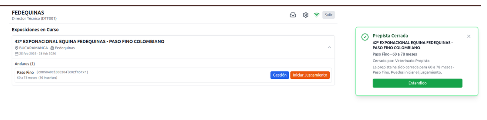
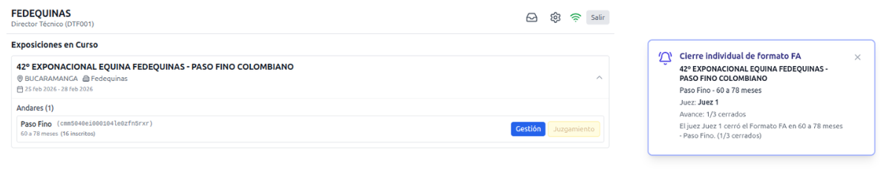
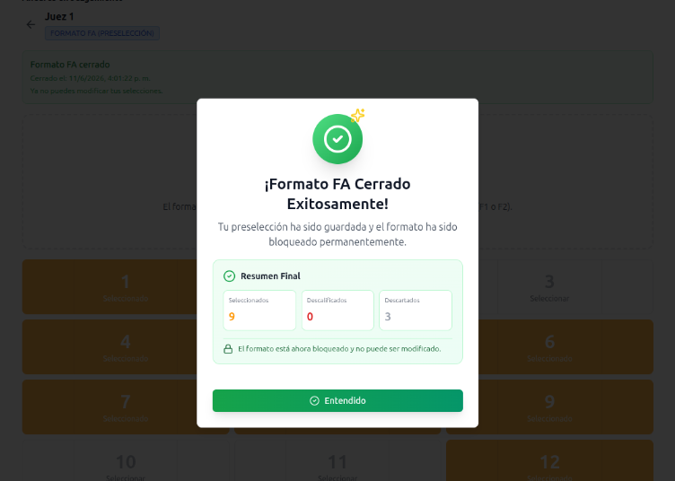

# Flujo por etapas: pre-pista, juzgamiento y Formato FA

## Objetivo

Definir el flujo operativo para el juzgamiento de ejemplares dentro de una categoria de feria, considerando director tecnico, veterinario y jueces.

Este documento sirve como base de entendimiento para backend, base de datos y frontend. Las imagenes se mantienen como referencia visual para el diseno de pantallas y componentes.

---

## Resumen del flujo

Una categoria dentro de una feria pasa por estas etapas:

1. Sin iniciar.
2. Pre-pista iniciada.
3. Pre-pista cerrada.
4. Juzgamiento iniciado.
5. Formato FA consolidado.
6. Juzgamiento cerrado.

Flujo principal:

```text
Director tecnico inicia pre-pista
  -> Veterinario revisa ejemplares
  -> Veterinario cierra pre-pista
  -> Director tecnico inicia juzgamiento
  -> Jueces diligencian Formato FA
  -> Director tecnico consolida Formato FA
  -> El juzgamiento queda cerrado
```

Punto clave:

El estado no debe guardarse en `categories`, porque `categories` es un catalogo global. El estado debe pertenecer a la combinacion feria + categoria.

---

## Roles involucrados

| Rol | Codigo Fedequinas | Responsabilidad |
| --- | --- | --- |
| Director tecnico | `3` | Controla el avance de etapas de la categoria. |
| Veterinario autorizado | `Z` | Realiza checkeo veterinario en pre-pista. |
| Juez | `2` | Diligencia el Formato FA durante juzgamiento. |

---

## Tablas actuales que participan

| Tabla | Uso en este flujo |
| --- | --- |
| `fairs` | Feria donde ocurre el proceso. |
| `categories` | Catalogo de categorias. |
| `fair_entries` | Inscripciones/participantes de una categoria en una feria. |
| `fair_staff` | Personas asignadas a la feria con rol operativo. |
| `people` | Personas que actuan como staff. |
| `roles` | Catalogo de roles Fedequinas. |
| `users` | Acceso al sistema para staff. |

Relacion base actual:

```text
fairs
  -> fair_entries
  -> categories

fairs
  -> fair_staff
  -> people
  -> users

fair_staff
  -> roles
```

Limitacion actual:

No existe una tabla que represente formalmente "esta categoria dentro de esta feria esta en pre-pista iniciada". Esa pieza es necesaria para manejar etapas, permisos y acciones.

---

## Estados principales

| Estado propuesto | Estado visible | Quien lo activa |
| --- | --- | --- |
| `NOT_STARTED` | Sin iniciar | Estado inicial |
| `PRE_RING_STARTED` | Pre-pista iniciada | Director tecnico |
| `PRE_RING_CLOSED` | Pre-pista cerrada | Veterinario |
| `JUDGING_STARTED` | Juzgamiento iniciado | Director tecnico |
| `FA_CONSOLIDATED` | Formato FA consolidado | Director tecnico |
| `JUDGING_CLOSED` | Juzgamiento cerrado | Sistema al consolidar juzgamiento |

Transiciones permitidas:

```text
NOT_STARTED
  -> PRE_RING_STARTED
  -> PRE_RING_CLOSED
  -> JUDGING_STARTED
  -> FA_CONSOLIDATED
  -> JUDGING_CLOSED
```

Regla:

No se deben permitir saltos de estado. Cada accion valida el estado actual antes de cambiarlo.

---

## Subestados del Formato FA

El Formato FA no debe ser un subestado global de la categoria. Debe ser un estado por juez.

| Estado FA | Descripcion |
| --- | --- |
| `PENDING` | El juez aun no inicia su Formato FA. |
| `STARTED` | El juez inicio el formato y puede seleccionar ejemplares. |
| `CLOSED` | El juez cerro su seleccion. |

Regla:

El director tecnico solo puede consolidar FA cuando todos los jueces requeridos tengan su Formato FA en `CLOSED`.

---

## Flujo detallado con referencias visuales

### 1. Sin iniciar

Estado inicial de la categoria en feria.

El director tecnico ve la categoria con el boton:

```text
Iniciar pre-pista
```

Al confirmar:

* Cambia el estado a `PRE_RING_STARTED`.
* Se registra quien ejecuto la accion.
* Se envia notificacion push al veterinario.

---

### 2. Pre-pista iniciada

El veterinario ve las categorias en estado `PRE_RING_STARTED`.

Se habilita el boton:

```text
Ir a checkeo veterinario
```

Referencia visual:


Durante el checkeo, el veterinario decide que ejemplares pasan a juzgamiento.

Como aun no existen perfiles de ejemplares ni sabemos que ejemplar tiene asignado cada montador, por ahora se trabaja con:

```text
fair_entries.track_position
```

Es decir, el numero en pista del montador/participante.

Regla central:

Solo los participantes con checkeo veterinario `APPROVED` pasan a la siguiente etapa. Los participantes `REJECTED`, `ABSENT` o `PENDING` no deben aparecer como disponibles para el juzgamiento ni para el Formato FA.

---

### 3. Cerrar pre-pista

Cuando el veterinario completa el checkeo de todos los participantes, se habilita:

```text
Cerrar pre-pista
```

Al confirmar:

* Cambia el estado a `PRE_RING_CLOSED`.
* Se notifica al director tecnico.
* La categoria queda lista para iniciar juzgamiento con los participantes aprobados.

Regla:

Todos los participantes de la categoria deben tener decision veterinaria antes de cerrar pre-pista. No se puede cerrar si existe algun participante en estado `PENDING`.

---

### 4. Iniciar juzgamiento

Cuando la categoria esta en `PRE_RING_CLOSED`, el director tecnico ve:

```text
Iniciar juzgamiento
```

Referencia visual:



Al confirmar:

* Cambia el estado a `JUDGING_STARTED`.
* Se define el conjunto de participantes habilitados para juzgamiento usando solo `veterinary_checks.status = APPROVED`.
* Se crean o habilitan Formatos FA para los jueces de la feria.
* Cada juez puede iniciar su propio FA.

---

### 5. Formato FA por juez

Cuando la categoria esta en `JUDGING_STARTED`, cada juez ve:

```text
Iniciar FA
```

Referencia visual:


Al iniciar:

* Se crea o actualiza el registro FA del juez a `STARTED`.
* El juez puede seleccionar solo ejemplares aprobados por el veterinario.
* El maximo inicial es de 10 seleccionados.
* El juez tambien puede descalificar un ejemplar seleccionando un motivo oficial.

Referencia visual:


Acciones disponibles en la grilla:

* Seleccionar ejemplar para el Formato FA.
* Quitar seleccion.
* Repetir pista, solicitando una nueva pasada al director tecnico.
* Descalificar ejemplar, seleccionando un motivo oficial.

Referencia visual de motivos de descalificacion:


Regla de descalificacion:

Cuando un juez descalifica un ejemplar, ese ejemplar queda descalificado de la competencia para esa categoria. Desde ese momento ningun otro juez puede seleccionarlo en su FA. Los demas jueces deben ver el ejemplar como `DISQUALIFIED` junto con el motivo registrado.

Referencia visual de ejemplar seleccionado y ejemplar descalificado dentro del FA:


Al cerrar:

* El FA del juez pasa a `CLOSED`.
* Se bloquean cambios posteriores.
* Los ejemplares seleccionados quedan como `SELECTED` para ese juez.
* Los ejemplares elegibles que no fueron seleccionados quedan como `DISCARDED` para ese juez.
* Los ejemplares descalificados quedan como `DISQUALIFIED` y se excluyen de la competencia.
* Se notifica al director tecnico.
* La notificacion indica cuantos jueces faltan por cerrar.

Referencias visuales:





Referencia visual del resumen antes de cerrar FA:


Cada juez, despues de cerrar, puede ver su propio Formato FA en modo lectura.

Referencias visuales:


---

### 6. Gestion del director tecnico

El director tecnico ve un boton:

```text
Gestion
```

Ese boton muestra el avance de:

* Pre-pista.
* Checkeo veterinario.
* Juzgamiento.
* Formatos FA por juez.
* Consolidado FA.

Referencia visual:


---

### 7. Consolidar FA

Cuando todos los jueces cerraron su FA, el director tecnico ve:

```text
Consolidar FA
```

Referencia visual:


Al confirmar:

* Se calcula el consolidado.
* Se guarda el resultado consolidado del Formato FA.
* El estado de FA queda como `FA_CONSOLIDATED`.
* El juzgamiento queda cerrado con estado `JUDGING_CLOSED`.
* Se habilita la vista del resultado consolidado.

Regla importante:

El director tecnico no cierra el Formato FA de los jueces. Cada juez cierra su propio FA. El director tecnico solo puede consolidar cuando todos los jueces ya cerraron su formato.

Referencia visual:


Decision pendiente:

Definir como se calcula el consolidado:

* Conteo simple de votos por participante.
* Ordenamiento por cantidad de selecciones.
* Desempate por posicion en pista.
* Desempate manual por director tecnico.

---

## Modelo de datos propuesto

### 1. `fair_category_stages`

Representa el estado de una categoria dentro de una feria.

```text
fair_category_stages
  id uuid primary key

  fair_id uuid not null references fairs(id)
  category_id uuid not null references categories(id)

  status varchar not null

  pre_ring_started_at timestamp nullable
  pre_ring_started_by_user_id uuid nullable references users(id)

  pre_ring_closed_at timestamp nullable
  pre_ring_closed_by_user_id uuid nullable references users(id)

  judging_started_at timestamp nullable
  judging_started_by_user_id uuid nullable references users(id)

  fa_consolidated_at timestamp nullable
  fa_consolidated_by_user_id uuid nullable references users(id)

  judging_closed_at timestamp nullable
  judging_closed_by_user_id uuid nullable references users(id)

  created_at timestamp not null
  updated_at timestamp not null

  unique(fair_id, category_id)
```

Justificacion:

`categories` es catalogo. El estado pertenece a la combinacion `fair_id` + `category_id`.

---

### 2. `veterinary_checks`

Registra la decision veterinaria por participante.

```text
veterinary_checks
  id uuid primary key

  fair_category_stage_id uuid not null references fair_category_stages(id)
  fair_entry_id uuid not null references fair_entries(id)
  veterinarian_user_id uuid not null references users(id)

  status varchar not null
  notes text nullable
  checked_at timestamp nullable

  created_at timestamp not null
  updated_at timestamp not null

  unique(fair_category_stage_id, fair_entry_id)
```

Estados sugeridos:

| Estado | Uso |
| --- | --- |
| `PENDING` | Sin decision. |
| `APPROVED` | Pasa checkeo. |
| `REJECTED` | No pasa checkeo. |
| `ABSENT` | No se presento. |

Regla:

El universo de participantes para juzgamiento sale de esta tabla. Solo los `fair_entry_id` con `status = APPROVED` pueden participar en el Formato FA.

---

### 3. `fa_judge_forms`

Representa el Formato FA de un juez para una categoria en feria.

```text
fa_judge_forms
  id uuid primary key

  fair_category_stage_id uuid not null references fair_category_stages(id)
  judge_user_id uuid not null references users(id)

  status varchar not null
  started_at timestamp nullable
  closed_at timestamp nullable

  created_at timestamp not null
  updated_at timestamp not null

  unique(fair_category_stage_id, judge_user_id)
```

Estados:

```text
PENDING
STARTED
CLOSED
```

---

### 4. `disqualification_reasons`

Catalogo de motivos oficiales de descalificacion.

```text
disqualification_reasons
  id uuid primary key

  external_id varchar nullable
  source_system varchar nullable

  code varchar not null
  name varchar not null
  description text nullable
  is_active boolean not null default true

  created_at timestamp not null
  updated_at timestamp not null

  unique(code)
```

Uso:

El juez debe escoger uno de estos motivos cuando descalifica un ejemplar. La lista debe reflejar los motivos oficiales del reglamento Fedequinas.

Por ahora no se implementa ninguna regla relacionada con cantidad de jueces requeridos para un motivo, porque esa interpretacion todavia no esta clara.

Referencia visual:


---

### 5. `judging_participants`

Representa los participantes habilitados para juzgamiento despues del checkeo veterinario.

```text
judging_participants
  id uuid primary key

  fair_category_stage_id uuid not null references fair_category_stages(id)
  fair_entry_id uuid not null references fair_entries(id)

  status varchar not null

  disqualified_by_judge_form_id uuid nullable references fa_judge_forms(id)
  disqualification_reason_id uuid nullable references disqualification_reasons(id)
  disqualified_at timestamp nullable

  created_at timestamp not null
  updated_at timestamp not null

  unique(fair_category_stage_id, fair_entry_id)
```

Estados:

```text
ELIGIBLE
DISQUALIFIED
```

Reglas:

* Se crean desde los `veterinary_checks` aprobados al iniciar juzgamiento.
* Solo participantes `ELIGIBLE` pueden ser seleccionados por los jueces.
* Si un juez descalifica un participante, el estado cambia a `DISQUALIFIED`.
* Un participante `DISQUALIFIED` queda bloqueado para todos los jueces.
* El motivo de descalificacion debe ser visible para los demas jueces.

---

### 6. `fa_judge_entry_decisions`

Guarda la decision de un juez sobre cada participante de su Formato FA.

```text
fa_judge_entry_decisions
  id uuid primary key

  fa_judge_form_id uuid not null references fa_judge_forms(id)
  judging_participant_id uuid not null references judging_participants(id)

  decision varchar not null
  selection_order integer nullable
  disqualification_reason_id uuid nullable references disqualification_reasons(id)

  created_at timestamp not null
  updated_at timestamp not null

  unique(fa_judge_form_id, judging_participant_id)
```

Decisiones:

```text
SELECTED
DISCARDED
DISQUALIFIED
```

Reglas:

* Maximo 10 decisiones `SELECTED` por `fa_judge_form_id`.
* Solo se puede editar si el formulario esta en `STARTED`.
* No se puede seleccionar un participante globalmente `DISQUALIFIED`.
* Al cerrar FA, todo participante elegible sin seleccion del juez queda como `DISCARDED` para ese juez.
* Si la decision es `DISQUALIFIED`, debe existir `disqualification_reason_id`.
* Una descalificacion actualiza tambien `judging_participants.status = DISQUALIFIED`.

Referencia visual:


---

### 7. `fa_judge_selections`

Tabla alternativa si se decide guardar solo seleccionados.

```text
fa_judge_selections
  id uuid primary key

  fa_judge_form_id uuid not null references fa_judge_forms(id)
  fair_entry_id uuid not null references fair_entries(id)
  selection_order integer nullable

  created_at timestamp not null
  updated_at timestamp not null

  unique(fa_judge_form_id, fair_entry_id)
```

Reglas:

* Maximo 10 selecciones por `fa_judge_form_id`.
* Solo se puede editar si el formulario esta en `STARTED`.
* No se puede seleccionar un `fair_entry` de otra feria/categoria.
* No se puede seleccionar un `fair_entry` que no tenga checkeo veterinario `APPROVED`.

Recomendacion:

Para el flujo actual, usar `fa_judge_entry_decisions` en lugar de esta tabla, porque ahora se necesita guardar seleccionados, descartados y descalificados.

---

### 8. `fa_consolidated_results`

Guarda el resultado consolidado del Formato FA.

```text
fa_consolidated_results
  id uuid primary key

  fair_category_stage_id uuid not null references fair_category_stages(id)
  judging_participant_id uuid not null references judging_participants(id)

  votes_count integer not null
  final_position integer nullable

  created_at timestamp not null
  updated_at timestamp not null

  unique(fair_category_stage_id, judging_participant_id)
```

Recomendacion:

Materializar estos resultados cuando el director tecnico presione `Consolidar FA`. Esa accion no cierra el FA de cada juez; consolida los FA ya cerrados y cierra el juzgamiento.

Regla:

El consolidado solo debe considerar participantes `ELIGIBLE`. Los participantes `DISQUALIFIED` quedan fuera del consolidado aunque algun juez los hubiera seleccionado antes de la descalificacion.

---

### 9. `workflow_events`

Tabla opcional pero recomendable para auditoria.

```text
workflow_events
  id uuid primary key

  fair_category_stage_id uuid not null references fair_category_stages(id)
  user_id uuid nullable references users(id)

  event_type varchar not null
  from_status varchar nullable
  to_status varchar nullable
  payload jsonb nullable

  created_at timestamp not null
```

Ejemplos de `event_type`:

```text
PRE_RING_STARTED
PRE_RING_CLOSED
JUDGING_STARTED
FA_STARTED
JUDGE_FA_CLOSED
JUDGING_PARTICIPANT_DISQUALIFIED
FA_CONSOLIDATED
JUDGING_CLOSED
```

---

### 10. `notification_outbox`

Tabla para manejar notificaciones push de forma confiable usando Pusher Beams.

```text
notification_outbox
  id uuid primary key

  recipient_user_id uuid nullable references users(id)
  recipient_role varchar nullable
  fair_category_stage_id uuid nullable references fair_category_stages(id)

  provider varchar not null default 'PUSHER_BEAMS'
  type varchar not null
  title varchar not null
  body text not null
  payload jsonb nullable

  status varchar not null default 'PENDING'
  sent_at timestamp nullable
  failed_at timestamp nullable
  error_message text nullable

  created_at timestamp not null
  updated_at timestamp not null
```

Recomendacion:

No enviar push directamente dentro de la transaccion principal. Registrar en outbox y procesar despues.

Proveedor definido:

```text
Pusher Beams
```

Credenciales esperadas por ambiente:

```text
PUSHER_BEAMS_INSTANCE_ID
PUSHER_BEAMS_PRIMARY_KEY
```

Reglas:

* No guardar `Instance ID` ni `Primary key` en la documentacion ni en el repositorio.
* Las credenciales deben vivir en variables de entorno del backend.
* La app/PWA debe registrar el dispositivo contra Pusher Beams para recibir notificaciones.
* El backend debe publicar notificaciones a Beams desde los registros pendientes de `notification_outbox`.
* Si Pusher Beams falla, el registro debe quedar con `status = FAILED` y `error_message`.
* Si el envio es exitoso, el registro debe quedar con `status = SENT` y `sent_at`.

Eventos que generan notificacion push en este flujo:

| Evento | Destinatario |
| --- | --- |
| `PRE_RING_STARTED` | Veterinario de la feria/categoria. |
| `PRE_RING_CLOSED` | Director tecnico. |
| `JUDGE_FA_CLOSED` | Director tecnico. |
| `JUDGING_PARTICIPANT_DISQUALIFIED` | Jueces de la feria/categoria. |
| `FA_CONSOLIDATED` | Jueces y director tecnico. |

---

## Relaciones recomendadas

```text
fair_category_stages
  -> fairs
  -> categories

veterinary_checks
  -> fair_category_stages
  -> fair_entries
  -> users (veterinario)

fa_judge_forms
  -> fair_category_stages
  -> users (juez)

disqualification_reasons
  -> fa_judge_entry_decisions
  -> judging_participants

judging_participants
  -> fair_category_stages
  -> fair_entries

fa_judge_entry_decisions
  -> fa_judge_forms
  -> judging_participants

fa_consolidated_results
  -> fair_category_stages
  -> judging_participants

workflow_events
  -> fair_category_stages
  -> users
```

---

## Reglas de negocio

### Generales

1. Cada proceso dentro de la aplicacion debe pedir confirmacion mediante un dialog.
2. Cada transicion debe validar el estado actual.
3. El director tecnico no puede iniciar juzgamiento si la pre-pista no esta cerrada.
4. Los jueces no pueden iniciar FA si el juzgamiento no esta iniciado.
5. El veterinario no puede editar checkeos despues de cerrar pre-pista, salvo regla explicita de reapertura.
6. El juez no puede editar su FA despues de cerrarlo.
7. El director tecnico no puede consolidar FA hasta que todos los jueces requeridos hayan cerrado su propio FA.
8. Las acciones deben quedar asociadas a `users.id`.

### Checkeo veterinario

1. El checkeo se hace sobre `fair_entries`.
2. Inicialmente se identifica al participante por `track_position`.
3. Un participante solo puede tener una decision veterinaria por categoria en feria.
4. Todos los participantes deben tener decision veterinaria antes de cerrar pre-pista.
5. No se puede cerrar pre-pista si existe algun participante `PENDING`.
6. Solo participantes aprobados avanzan al proceso de juzgamiento.
7. Participantes rechazados, ausentes o pendientes quedan fuera del Formato FA.

### Formato FA

1. El Formato FA es una preseleccion que hace cada juez.
2. Cada juez tiene un solo Formato FA por categoria en feria.
3. Cada juez puede seleccionar maximo 10 participantes.
4. Cada juez solo puede seleccionar participantes aprobados por el veterinario.
5. Cada juez puede descalificar un participante si selecciona un motivo oficial.
6. Un participante descalificado queda bloqueado para todos los jueces.
7. Los demas jueces pueden ver el motivo de descalificacion.
8. Al cerrar FA, los participantes elegibles no seleccionados quedan `DISCARDED` para ese juez.
9. Una seleccion no puede repetirse dentro del mismo FA.
10. El FA cerrado queda en modo lectura para el juez.
11. El consolidado se calcula usando los FA cerrados por los jueces.
12. Consolidar FA cierra el juzgamiento, no los formatos individuales de los jueces.

---

## Permisos por rol

| Accion | Director tecnico | Veterinario | Juez |
| --- | --- | --- | --- |
| Iniciar pre-pista | Si | No | No |
| Checkeo veterinario | No | Si | No |
| Cerrar pre-pista | No | Si | No |
| Iniciar juzgamiento | Si | No | No |
| Iniciar FA | No | No | Si |
| Seleccionar participantes FA | No | No | Si |
| Descalificar participante | No | No | Si |
| Cerrar FA propio | No | No | Si |
| Ver gestion | Si | Opcional | Opcional |
| Consolidar FA | Si | No | No |
| Cerrar juzgamiento al consolidar | Si | No | No |

---

## Endpoints sugeridos

### Director tecnico

```text
POST /fair-categories/:id/pre-ring/start
POST /fair-categories/:id/judging/start
GET  /fair-categories/:id/management
POST /fair-categories/:id/fa/consolidate
```

### Veterinario

```text
GET   /fair-categories/:id/veterinary-checks
PATCH /fair-categories/:id/veterinary-checks/:fairEntryId
POST  /fair-categories/:id/pre-ring/close
```

### Juez

```text
POST /fair-categories/:id/fa/start
GET  /fair-categories/:id/fa
PUT  /fair-categories/:id/fa/decisions
GET  /fair-categories/:id/fa/disqualification-reasons
POST /fair-categories/:id/fa/participants/:judgingParticipantId/disqualify
POST /fair-categories/:id/fa/close
```

---

## Implementacion incremental sugerida

### Fase 1

Implementar lo minimo para tener el flujo completo:

1. `fair_category_stages`
2. `veterinary_checks`
3. `fa_judge_forms`
4. `disqualification_reasons`
5. `judging_participants`
6. `fa_judge_entry_decisions`
7. `fa_consolidated_results`

No implementar todavia:

* `workflow_events`
* `notification_outbox`
* reaperturas de etapas
* asignacion granular de jueces por categoria
* `fa_judge_selections`, salvo que se decida simplificar el flujo y no guardar descartados/descalificados

### Fase 2

Agregar trazabilidad y robustez:

1. `workflow_events`
2. `notification_outbox`
3. manejo formal de notificaciones push
4. historial de cambios

### Fase 3

Agregar reglas avanzadas:

1. Reapertura controlada de pre-pista o FA.
2. Asignacion de jueces por categoria.
3. Desempates.
4. Relacion con entidad `horses` cuando exista.

---

## Decisiones pendientes

1. Confirmar si todos los jueces de una feria deben diligenciar FA para todas las categorias.
2. Confirmar que motivos o estados puede registrar el veterinario al no aprobar un participante.
3. Confirmar el catalogo oficial inicial de motivos de descalificacion.
4. Confirmar que significan las etiquetas visuales `1 juez` / `2 jueces` en los motivos de descalificacion antes de modelarlas.
5. Confirmar si el director tecnico puede reabrir pre-pista, juzgamiento o FA.
6. Confirmar si el consolidado FA se basa en conteo simple o tiene reglas de desempate.
7. Confirmar si se necesita guardar orden de seleccion del juez.
8. Confirmar si el limite de 10 seleccionados es fijo o configurable por feria/categoria.
9. Confirmar si se debe soportar trabajo offline en PWA.
10. Confirmar si el resultado FA se conecta despues con `fair_results` o si es un flujo independiente.
11. Confirmar si se necesita una accion separada para cerrar juzgamiento o si siempre se cierra automaticamente al consolidar FA.

---

## Recomendacion final

La pieza central a crear es `fair_category_stages`.

Sin esa tabla, el sistema no tiene un lugar correcto para guardar el estado de una categoria dentro de una feria. Despues de eso, el flujo se divide naturalmente en:

* `veterinary_checks` para pre-pista.
* `judging_participants` para controlar elegibles y descalificados globales.
* `fa_judge_forms` y `fa_judge_entry_decisions` para cada juez.
* `fa_consolidated_results` para el resultado consolidado.

Este modelo permite implementar primero el flujo usando `fair_entries.track_position` como identificador visible del participante y mantener las imagenes como referencia directa para construir la experiencia del frontend.
