# Guia UX/UI para PWAs del flujo por etapas

## Objetivo

Definir mejoras visuales, de experiencia de usuario y buenas practicas frontend para las PWAs de director tecnico, veterinario y juez.

El objetivo es que el flujo sea claro, confiable, facil de usar en feria y apto para un entorno family friendly: lenguaje respetuoso, interfaz tranquila, confirmaciones claras y acciones criticas sin ambiguedad.

Este documento complementa:

```text
docs/STAGED_FLOW/Documentation.md
```

---

## Principios de experiencia

### Claridad operativa

Cada pantalla debe responder rapidamente:

* Donde estoy.
* Que categoria estoy gestionando.
* En que etapa va el proceso.
* Que accion puedo ejecutar.
* Que consecuencias tiene esa accion.

### Seguridad en acciones criticas

Acciones como cerrar pre-pista, cerrar FA, descalificar, consolidar FA o cerrar juzgamiento deben pedir confirmacion mediante dialog.

Cada dialog debe explicar:

* Que se va a hacer.
* Si la accion bloquea cambios posteriores.
* Que registros se veran afectados.
* Quien sera notificado.

### Family friendly

La interfaz debe usar lenguaje profesional, tranquilo y no agresivo.

Evitar mensajes como:

```text
Error fatal
Accion prohibida
No puedes hacer esto
```

Preferir:

```text
No es posible continuar todavia.
Faltan participantes por revisar.
Este ejemplar ya fue descalificado.
```

### Mobile first

Las PWAs se usaran en pista, prepista o lugares con movimiento. La interfaz debe funcionar bien en celular:

* Botones grandes.
* Estados visibles.
* Textos cortos.
* Alto contraste.
* Navegacion simple.
* Feedback inmediato.

---

## Estructura visual comun

Todas las PWAs deben compartir una base visual consistente.

### Header

Debe mostrar:

* Nombre de la feria.
* Rol del usuario.
* Categoria actual.
* Estado de conectividad.
* Acceso a salir/cerrar sesion.

Ejemplo:

```text
EXPOSEDE
Juez 1
Andares en juzgamiento
Online
```

### Barra de estado del flujo

Mostrar una linea compacta de progreso:

```text
Sin iniciar -> Pre-pista -> Juzgamiento -> FA -> Consolidado
```

En mobile se puede representar como chips:

```text
[Pre-pista cerrada] [Juzgamiento iniciado]
```

### Estados visuales

Usar colores con significado consistente:

| Estado | Color sugerido | Uso |
| --- | --- | --- |
| Pendiente | Gris | Falta accion. |
| En progreso | Azul | Etapa activa. |
| Aprobado/seleccionado | Verde o naranja controlado | Participante valido o elegido. |
| Advertencia | Amarillo | Atencion sin bloqueo. |
| Descalificado/rechazado | Rojo suave | Estado bloqueante. |
| Cerrado | Azul oscuro o neutro | Accion finalizada. |

No depender solo del color. Siempre agregar texto o icono.

---

## PWA del director tecnico

### Objetivo del director tecnico

Controlar el avance de la categoria:

1. Iniciar pre-pista.
2. Ver avance veterinario.
3. Iniciar juzgamiento.
4. Ver avance de Formatos FA.
5. Consolidar FA.
6. Ver juzgamiento cerrado.

### Pantalla de categorias

Cada categoria debe mostrar:

* Nombre de categoria.
* Estado actual.
* Total de participantes.
* Participantes aprobados por veterinario.
* Participantes rechazados/ausentes.
* Numero de jueces con FA cerrado.
* Accion primaria disponible.

Ejemplo de contenido:

```text
Andares en Juzgamiento
Pre-pista cerrada
12 participantes - 10 aprobados
FA: 2 de 3 jueces cerrados
```

### Botones principales

Debe haber una sola accion primaria visible por estado:

| Estado | Accion primaria |
| --- | --- |
| `NOT_STARTED` | Iniciar pre-pista |
| `PRE_RING_CLOSED` | Iniciar juzgamiento |
| `JUDGING_STARTED` | Ver gestion |
| Todos los FA cerrados | Consolidar FA |
| `JUDGING_CLOSED` | Ver consolidado |

### Vista Gestion

La vista `Gestion` debe mostrar el avance por bloques:

* Pre-pista.
* Checkeo veterinario.
* Jueces y Formatos FA.
* Descalificaciones.
* Consolidado.

Referencia:

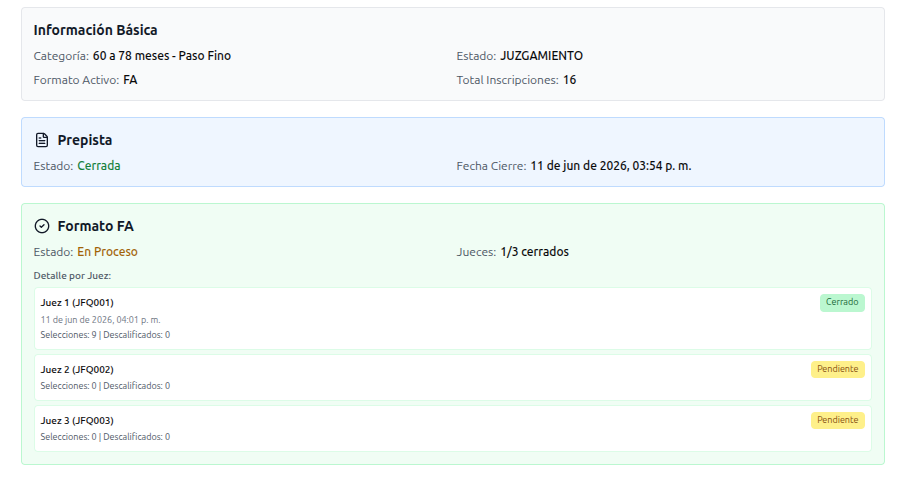

### Consolidar FA

El boton `Consolidar FA` solo aparece si todos los jueces cerraron su FA.

Referencia:

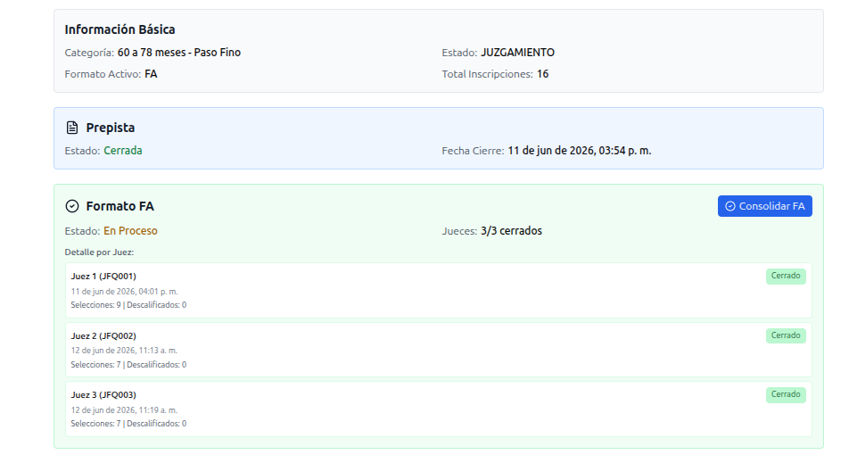

Antes de confirmar, mostrar:

* Total de jueces.
* Jueces cerrados.
* Participantes seleccionados.
* Participantes descartados.
* Participantes descalificados.

Despues de confirmar, mostrar resultado consolidado:

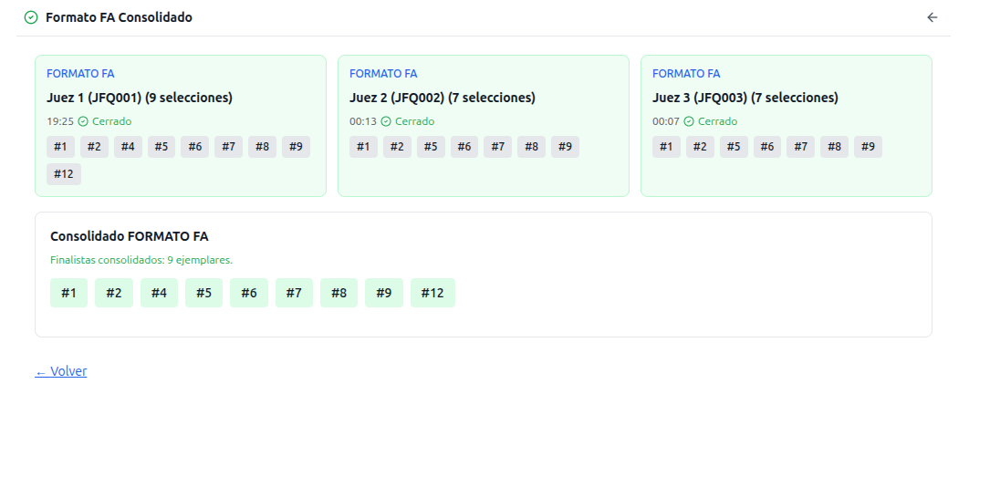

---

## PWA del veterinario

### Objetivo del veterinario

Revisar todos los participantes de una categoria antes del juzgamiento.

### Pantalla de pre-pista

Debe mostrar:

* Categoria.
* Estado `PRE_RING_STARTED`.
* Total de participantes.
* Pendientes.
* Aprobados.
* Rechazados.
* Ausentes.

Referencia:

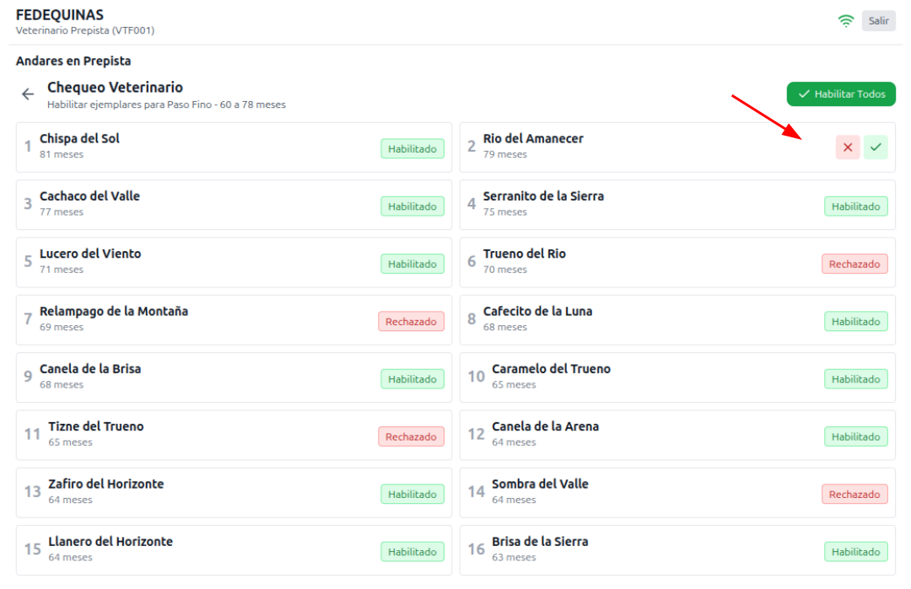

### Estados por participante

Cada participante debe tener estado visible:

| Estado | Texto visible |
| --- | --- |
| `PENDING` | Pendiente |
| `APPROVED` | Aprobado |
| `REJECTED` | No aprobado |
| `ABSENT` | Ausente |

### Cerrar pre-pista

El boton `Cerrar pre-pista` solo se habilita cuando todos los participantes tienen decision veterinaria.

Si quedan pendientes, mostrar:

```text
Faltan 3 participantes por revisar.
```

Dialog de confirmacion:

```text
Cerrar pre-pista
Todos los participantes tienen decision veterinaria.
Solo los aprobados pasaran a juzgamiento.
```

---

## PWA del juez

### Objetivo del juez

Diligenciar su Formato FA de preseleccion durante juzgamiento.

### Inicio de FA

Cuando la categoria esta en `JUDGING_STARTED`, el juez ve:

```text
Iniciar FA
```

Referencia:

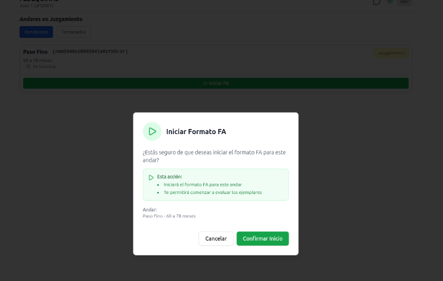

### Grilla de participantes

La grilla debe mostrar solo participantes aprobados por veterinario y no descalificados globalmente.

Cada tarjeta debe mostrar:

* Numero en pista.
* Estado para el juez.
* Accion seleccionar/quitar.
* Accion repetir pista.
* Accion descalificar.

Referencia:

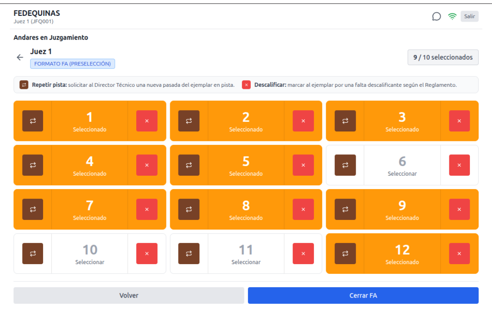

### Seleccion

El contador debe ser visible:

```text
7 / 10 seleccionados
```

Reglas visuales:

* Seleccionados deben destacarse claramente.
* No seleccionados deben verse disponibles.
* Descalificados deben verse bloqueados.

Referencia:

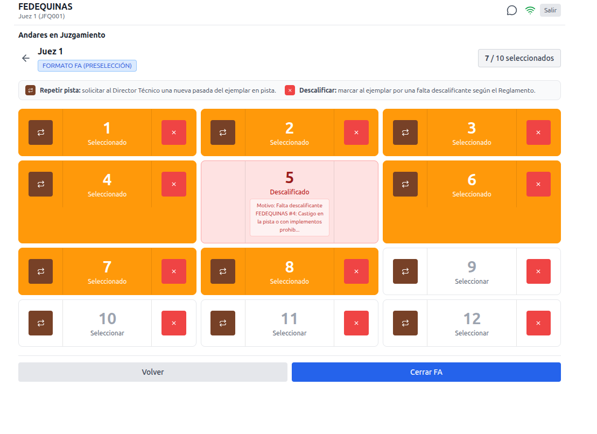

### Descalificacion

La accion de descalificar debe abrir una pantalla o dialog con motivos oficiales.

Referencia:

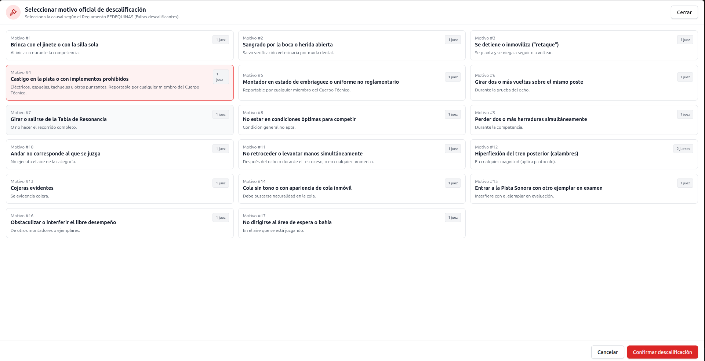

Reglas UX:

* El juez debe seleccionar un motivo.
* El boton confirmar debe quedar deshabilitado hasta seleccionar motivo.
* El dialog debe advertir que el ejemplar quedara fuera de la competencia.
* Despues de confirmar, el participante queda bloqueado para todos los jueces.
* Los demas jueces ven el motivo.

Mensaje sugerido:

```text
Confirmar descalificacion
Este ejemplar quedara fuera de la competencia y no podra ser seleccionado por otros jueces.
```

### Cerrar FA

Antes de cerrar, mostrar resumen:

* Seleccionados.
* Descalificados.
* Descartados.

Referencia:

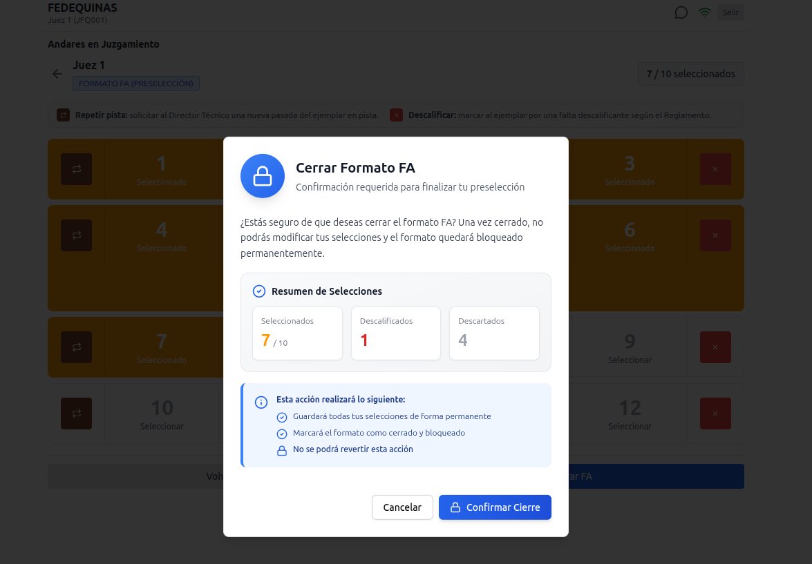

Dialog:

```text
Cerrar Formato FA
Una vez cerrado, no podras modificar tus selecciones.
```

Despues de cerrar:

* El FA queda en modo lectura.
* El juez puede ver su formato.
* El director tecnico recibe notificacion.

Referencias:

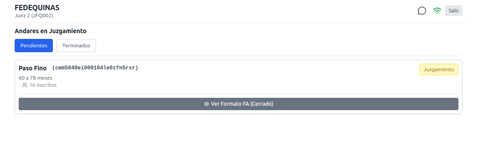

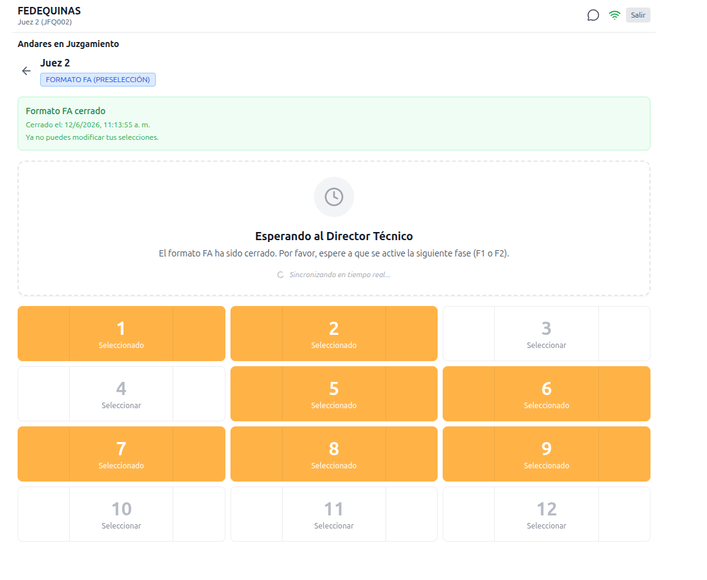

---

## Notificaciones push

Proveedor definido:

```text
Pusher Beams
```

Eventos relevantes:

| Evento | Usuario destino | Mensaje sugerido |
| --- | --- | --- |
| Pre-pista iniciada | Veterinario | Pre-pista iniciada para la categoria. |
| Pre-pista cerrada | Director tecnico | La pre-pista ya fue cerrada. |
| FA cerrado por juez | Director tecnico | Un juez cerro su Formato FA. |
| Ejemplar descalificado | Jueces | Un ejemplar fue descalificado. |
| FA consolidado | Jueces y director tecnico | El Formato FA fue consolidado. |

Buenas practicas:

* No mostrar informacion sensible en el cuerpo de la push.
* La push debe llevar al usuario a la categoria relacionada.
* Si la PWA esta abierta, tambien mostrar feedback dentro de la app.
* Si falla el envio, no bloquear el flujo principal.

---

## Buenas practicas frontend

### Componentizacion

Separar componentes por responsabilidad:

```text
StageStatusBadge
FlowProgress
CategoryActionButton
ParticipantCard
VeterinaryDecisionControl
FaSelectionGrid
DisqualificationReasonList
ConfirmActionDialog
OfflineBanner
PushNotificationPrompt
```

### Estado de UI

Separar:

* Estado remoto del servidor.
* Estado local del formulario.
* Estado derivado para contadores.
* Estado de carga/error.

Evitar duplicar reglas criticas solo en frontend. El backend debe validar siempre:

* Estados permitidos.
* Participantes aprobados.
* Maximo 10 selecciones.
* Bloqueo de descalificados.
* Cierre de FA.

### Accesibilidad

* Botones con texto claro.
* Estados no dependientes solo de color.
* Contraste suficiente.
* Targets tactiles de al menos 44px.
* Dialogs con foco controlado.
* Mensajes de error asociados al campo o accion.

### Rendimiento

* Evitar re-render masivo de grillas.
* Memoizar tarjetas de participantes si la lista crece.
* Cargar datos por categoria.
* No bloquear la UI mientras se envia push.
* Usar estados optimistas solo en acciones reversibles. Para descalificar/cerrar/consolidar, esperar confirmacion del backend.

### Clean code

Reglas recomendadas:

* Nombres de componentes por dominio, no por apariencia.
* Hooks separados para consultas y mutaciones.
* Funciones puras para calcular contadores.
* Tipos compartidos para estados.
* Constantes centralizadas para estados y labels.
* No hardcodear codigos de rol en componentes visuales.
* No mezclar llamadas API dentro de componentes de presentacion.

Ejemplo de organizacion:

```text
src/features/staged-flow/
  components/
  hooks/
  services/
  types/
  utils/
```

---

## Estados vacios y errores

### Sin categorias

```text
No hay categorias asignadas por ahora.
```

### Sin conexion

```text
Sin conexion. Podras continuar cuando recuperes internet.
```

### Accion no disponible

```text
Esta accion estara disponible cuando todos los jueces cierren su FA.
```

### Participante bloqueado

```text
Este ejemplar fue descalificado y ya no puede seleccionarse.
```

---

## Checklist antes de implementar

1. Confirmar estados finales y labels visibles.
2. Confirmar motivos oficiales de descalificacion.
3. Confirmar si el flujo necesita soporte offline.
4. Definir componentes compartidos.
5. Definir rutas por rol o ruta unica con vistas por rol.
6. Definir payloads API para cada accion.
7. Definir registro del dispositivo en Pusher Beams.
8. Validar disenos en mobile primero.
9. Probar confirmaciones de acciones criticas.
10. Probar lectura de estados bloqueados entre jueces.
